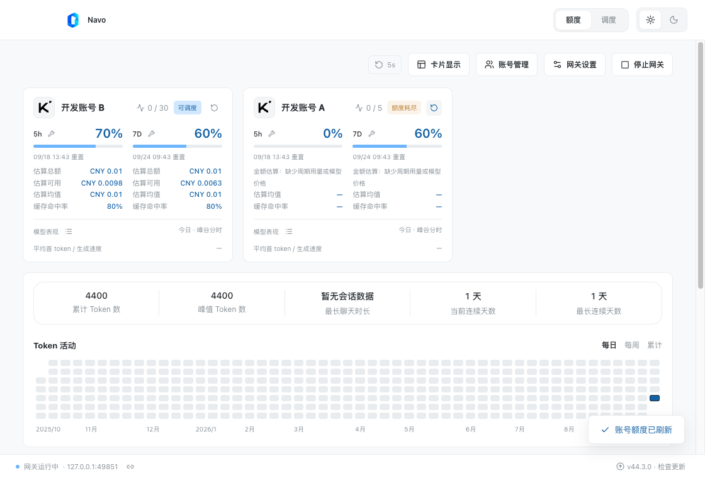
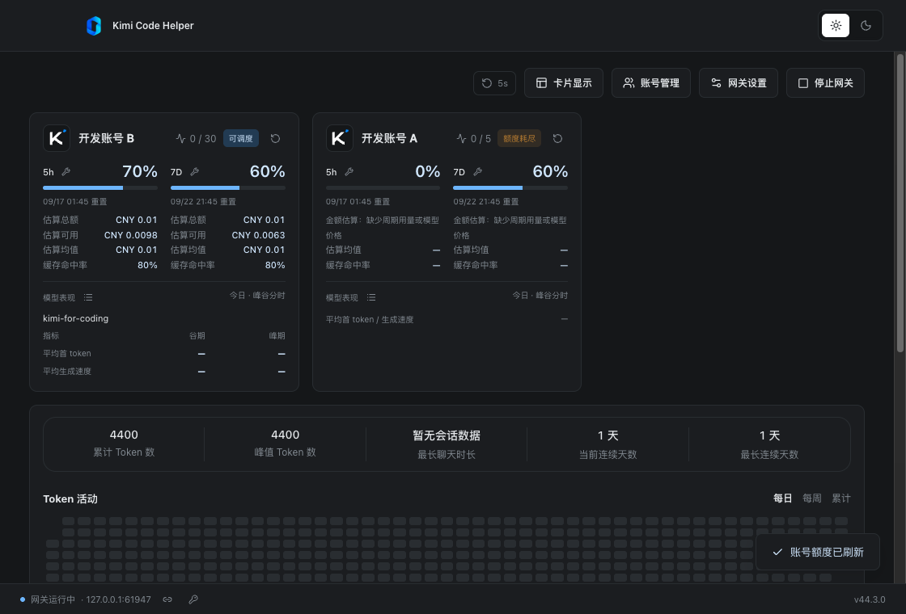
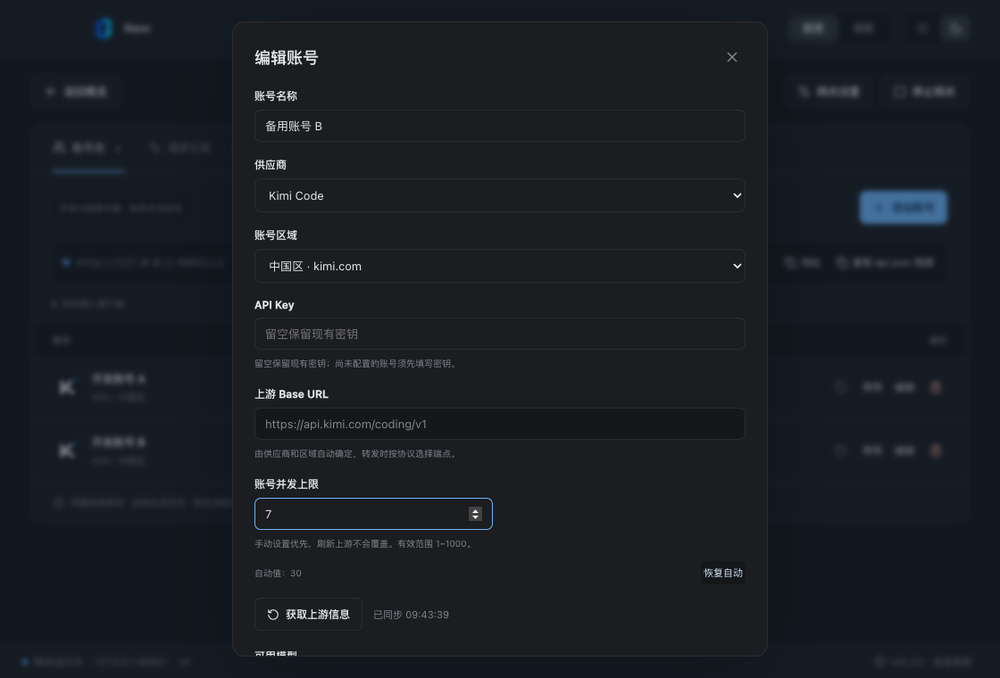
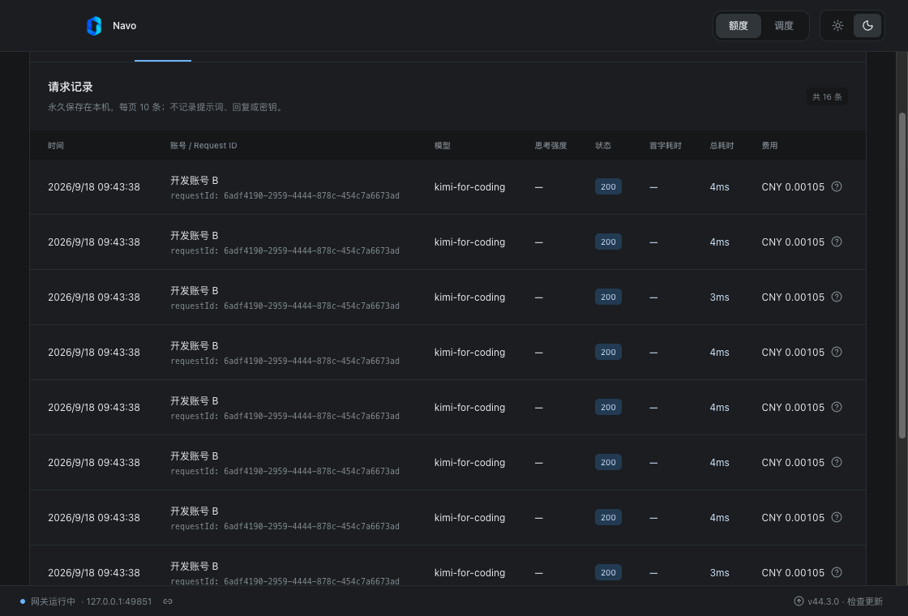
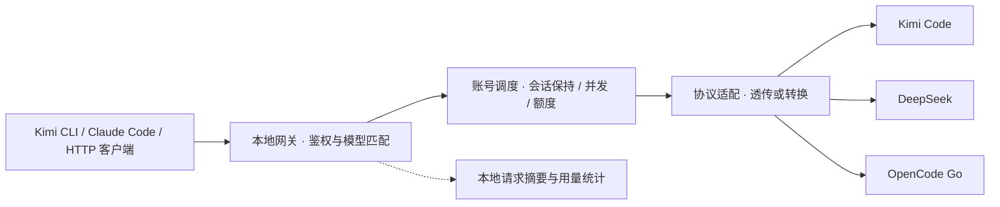

<p align="center">
  
</p>

<h1 align="center">Kimi Code Helper</h1>

<p align="center">一个桌面应用，统一管理 Kimi Code、DeepSeek 与 OpenCode Go 账号、请求和用量。</p>

<p align="center"><strong>简体中文</strong> · <a href="README.en.md">English</a></p>

<p align="center">
  <a href="https://github.com/DuskLin/kimi-code-helper/releases">下载安装包</a> ·
  <a href="#快速开始">快速开始</a> ·
  <a href="#客户端接入">客户端接入</a> ·
  <a href="docs/reference.zh-CN.md">技术参考</a>
</p>



> 截图来自真实 Electron 界面的本地冒烟测试，账号、额度、费用和请求均为模拟数据，截图端口为测试动态端口。当前应用界面为中文；本项目提供中英文 README。

## 能做什么

Kimi Code Helper 将多个供应商账号汇入本地账号池，通过 `127.0.0.1` 上的 HTTP 网关为编程助手提供统一入口。客户端使用网关密钥，应用负责选择可用账号、转发请求和记录用量。

| 功能           | 说明                                                                                    |
| -------------- | --------------------------------------------------------------------------------------- |
| 多供应商账号池 | 添加、编辑、启停账号，同步模型、额度或余额                                              |
| 智能调度       | 优先保持会话绑定；新会话按并发与剩余额度评分，故障时切换账号                            |
| 三种客户端协议 | 支持 OpenAI Responses、Chat Completions 和 Anthropic Messages，按模型协议配置透传或转换 |
| 用量与性能     | Token 趋势、缓存命中率、消耗热力图、首 token 耗时、生成速度及峰谷表现                   |
| 费用参考       | 上游报告费用优先，否则按模型单价估算；支持价格配置和订阅额度估值                        |
| 桌面体验       | 浅色／深色主题、卡片显示设置、可调整账号卡片顺序                                        |
| 本地存储       | 系统安全存储加密配置；SQLite 保存请求摘要，不保存提示词或回复正文                       |

## 界面预览

### 深色概览

在同一屏查看账号可调度状态、额度窗口、模型表现和 Token 活动。



### 账号配置

选择供应商与区域，填写 API Key 后同步上游信息。并发上限可自动获取或手动设置，模型支持的上游协议可单独配置。



### 请求记录

按请求查看账号、Request ID、模型、思考强度、状态、首字耗时、总耗时和费用，便于定位失败和比较性能。



## 支持的供应商

| 供应商      | 账号类型                   | 同步信息                             |
| ----------- | -------------------------- | ------------------------------------ |
| Kimi Code   | 中国区／国际区 API Key     | 模型、5 小时／7 天额度、并发上限     |
| DeepSeek    | 开放平台 API Key，按量付费 | 模型、各币种余额（分别显示，不换算） |
| OpenCode Go | 已订阅 Go 的 API Key       | 模型、5 小时／周／月额度窗口         |

上游地址由应用固定，模型列表由上游同步。OpenCode Zen 按量付费账号不在当前接入范围。协议最终可用性取决于供应商和模型；在界面中勾选协议不会让上游新增能力。

## 快速开始

### 安装或从源码启动

在 [Releases](https://github.com/DuskLin/kimi-code-helper/releases) 查看可用版本与附件。打包配置支持 macOS（DMG / ZIP）、Windows（NSIS EXE）和 Linux（AppImage）；macOS 使用 ad hoc 签名，尚未配置开发者证书签名和公证，Windows 尚未配置代码签名。

从源码运行需要 **Node.js 22.12.0 或更高版本**及 npm：

```bash
git clone https://github.com/DuskLin/kimi-code-helper.git
cd kimi-code-helper
npm ci
npm run dev
```

### 添加账号并启动网关

1. 打开「账号管理」，在账号池中添加账号，选择供应商并填写该平台的 API Key。
2. 等待模型、额度或余额同步成功，确认账号启用；按需设置并发上限和模型协议。
3. 启动网关，默认监听 `127.0.0.1:17300`；端口被占用时，在停止网关后修改端口。
4. 从账号池复制地址和**网关密钥**，或直接复制「Kimi 配置」「Claude 配置」。
5. 按下方示例配置客户端，发送请求后在概览和请求记录中查看结果。

## 工作原理



同一会话优先复用可用账号以保留缓存优势；账号满载、额度耗尽、认证失败或冷却时重新分配。连接失败及部分 HTTP 错误可触发重试，**已开始返回响应后不再重试**。使用 `X-Session-Id` 或 `prompt_cache_key` 提供稳定的会话标识，绑定按模型隔离。

## 客户端接入

以下示例使用默认端口。请替换 `<GATEWAY_KEY>` 为应用中复制的网关密钥，模型 ID 必须存在于已启用账号的可用模型列表中。上游 API Key 填在应用中。

### Kimi Code CLI

点击「Kimi 配置」可复制配置。将下面内容合并到 `~/.kimi/config.toml`，保留其他设置；`default_model` 应位于文件顶层：

```toml
default_model = "kimi-helper"

[providers.kimi-helper]
type = "kimi"
base_url = "http://127.0.0.1:17300/v1"
api_key = "<GATEWAY_KEY>"

[models.kimi-helper]
provider = "kimi-helper"
model = "kimi-for-coding"
max_context_size = 262144
```

也可以通过 `kimi --model kimi-helper` 选择模型。切换模型时，请同步调整模型 ID 和相应上下文配置。

### Claude Code / Anthropic 客户端

在启动客户端的同一个终端中设置环境变量（macOS / Linux / Git Bash）：

```bash
export ANTHROPIC_BASE_URL='http://127.0.0.1:17300'
export ANTHROPIC_AUTH_TOKEN='<GATEWAY_KEY>'
export ANTHROPIC_MODEL='kimi-for-coding'
claude
```

Anthropic Base URL 不带末尾 `/v1`，客户端会自行追加接口路径。Windows PowerShell 使用 `$env:ANTHROPIC_BASE_URL='http://127.0.0.1:17300'` 等同名环境变量写法。

### 通用 HTTP / OpenAI 兼容客户端

OpenAI 兼容客户端的 Base URL 为 `http://127.0.0.1:17300/v1`，API Key 为网关密钥。可先查询模型，再发送流式请求：

```bash
curl http://127.0.0.1:17300/v1/models \
  -H 'Authorization: Bearer <GATEWAY_KEY>'

curl http://127.0.0.1:17300/v1/chat/completions \
  -H 'Authorization: Bearer <GATEWAY_KEY>' \
  -H 'Content-Type: application/json' \
  -H 'X-Session-Id: my-session' \
  -d '{"model":"kimi-for-coding","messages":[{"role":"user","content":"你好"}],"stream":true}'
```

| 方法 | 端点                        | 用途                                 |
| ---- | --------------------------- | ------------------------------------ |
| GET  | `/v1/models`                | 汇总已启用、已同步账号的模型         |
| POST | `/v1/chat/completions`      | OpenAI Chat Completions              |
| POST | `/v1/responses`             | OpenAI Responses                     |
| POST | `/v1/messages`              | Anthropic Messages                   |
| POST | `/v1/messages/count_tokens` | Token 计数；OpenCode Go 使用本地估算 |

鉴权支持 `Authorization: Bearer …` 或 `x-api-key`。OpenCode Go 的本地 Token 估算带有 `x-token-count-estimated: true` 响应头。

## 使用边界与数据存储

- 网关仅监听 `127.0.0.1`，供本机客户端使用；不支持 WebSocket。请求体上限 8 MB，默认总超时 300 秒，无可用账号时返回 503。
- 跨协议请求需携带完整消息历史；不支持跨上游私有引用（如 `previous_response_id`、`file_id`）、上游托管搜索、后台任务及 `n > 1`，这些情况会明确报错。
- 费用估算按当前单价计算，缺失价格与用量按 0 计，价格更新后历史估算会变化；不同币种分别显示。费用和额度估值不能视为实际账单，中断消耗仅包含中断前已报告的用量。
- 配置存放于 Electron 用户数据目录的 `gateway.json`，通过系统安全存储加密；Linux 无可用密钥环时拒绝保存凭据。加密配置依赖原系统钥匙串，不适合直接复制到其他机器。
- 请求摘要保存在同目录的 `gateway.json.requests.sqlite`，不自动清理；主题保存在 `settings.json`。macOS 默认目录为 `~/Library/Application Support/Kimi Code Helper/`。
- macOS 关闭窗口后网关继续运行，退出应用才停止；其他平台关闭最后一个窗口会退出。会话绑定、冷却及运行时调度状态在退出后清空，配置和请求摘要保留。

## 开发与验证

技术栈：**Electron · React · TypeScript · electron-vite**。

| 命令                      | 用途                                                     |
| ------------------------- | -------------------------------------------------------- |
| `npm run dev`             | 开发模式，监听主进程、预加载和界面变更                   |
| `npm run typecheck`       | TypeScript 检查                                          |
| `npm run build`           | 检查类型并构建到 `out/`                                  |
| `npm start`               | 运行已构建的应用                                         |
| `npm run test:unit`       | 网关、协议转换、调度、用量等单元测试                     |
| `npm run test:smoke`      | 构建并运行真实 Electron 冒烟测试                         |
| `npm run test:update:mac` | macOS 隔离应用：下载校验、替换、重启与备份（需编译工具） |
| `npm test`                | 单元测试和冒烟测试                                       |
| `npm run pack`            | 生成当前平台应用目录                                     |
| `npm run dist`            | 生成当前平台安装包到 `dist/`                             |
| `npm run format:check`    | 检查格式（`npm run format` 可自动格式化）                |

冒烟测试需要图形环境和系统安全存储，使用临时配置与本地模拟上游，不消耗真实账号额度，截图输出到 `artifacts/`。它不代表真实供应商端到端验证。开发模式重启会中断请求；需要稳定运行时先构建，再使用 `npm start`。

```text
src/
  main/                 # Electron 生命周期、IPC 与本地服务
    services/           # 网关、调度、协议转换、存储与价格目录
  preload/              # 渲染进程可调用的受限 API
  renderer/src/         # 账号、概览、图表和主题界面
  shared/               # 类型、协议、额度、用量与费用计算
tests/                  # 单元测试
scripts/                # 开发启动器与 Electron 冒烟测试
docs/                   # 技术参考、协议审计与 README 配图
.github/workflows/      # 跨平台构建与发布
```

## 打包与发布

通常在对应操作系统上运行 `npm run dist`。仓库的 [发布工作流](.github/workflows/release.yml) 会在推送 `v` 开头的版本 tag 或发布 GitHub Release 时触发，仅构建 macOS x64（Intel）与 arm64（Apple Silicon）的 DMG / ZIP 安装包。也可在 Actions 页面手动运行工作流，填写已有 tag 来重新打包，无需移动标签。

```bash
git tag v0.1.0
git push origin v0.1.0
```

请使用尚未发布的新版本号。推送 tag 会创建 Release 草稿（不存在时）并上传附件；发布已有 Release 会保留标题和手写说明，更新自动摘要及附件。两种 Mac 架构均构建成功后才上传 Release 附件，Actions 产物保留 14 天。

每次发布会自动生成中文的“新增功能 / 问题修复 / 其他改进”摘要，重跑时更新自动摘要并保留手写说明。支持中文提交说明、`Release-Note-zh` 提交正文及版本级说明文件，详见 [中文发布说明](release-notes/README.md)。

### App 内升级

安装版启动 10 秒后检查 GitHub 正式版，此后每 6 小时检查一次，也可点击右下角「检查更新」。发现新版会提示并后台下载，下载完成后点击「重启并安装」即可自动安装并重新打开，账号和设置保留。安装前会确认重启，因为这会中断正在处理的网关请求。开发模式不检查更新，预发布版不推送给用户。

macOS 从 GitHub 下载对应架构的 ZIP，校验 SHA-512、应用标识和版本后，在退出时自动替换 App；无需 Apple Developer 证书或上架 App Store。请先将 App 安装到可写目录（通常为 Applications），不要直接从 DMG 运行。替换或启动命令失败时恢复旧版；旧 App 备份保留在安装目录旁的 `.kimi-helper-update-*/previous.app`，确认新版正常后可删除该备份目录。Windows 使用 NSIS 安装器，Linux 需运行可写的 AppImage。

CI 会上传安装包、blockmap 和更新清单，并合并 macOS 两种架构的 `latest-mac.yml`。建议等 Release 草稿的全部附件上传完毕再发布；不要删除 ZIP 或更新清单。第一次需手动安装包含此功能的版本，之后发布更高版本即可在 App 内升级。更新源是公开 GitHub Releases，不在客户端内放置 GitHub Token。

## 更多文档

- [协议转换实现](docs/protocol-conversion.zh-CN.md)：请求映射、工具历史、流式状态机、用量与错误处理。
- [详细技术参考](docs/reference.zh-CN.md)：同步、调度评分、统计口径、配置迁移与存储细节（中文）。
- [截图来源](docs/images/README.md)：配图说明与更新方式。

## 许可证

[MIT](LICENSE)
