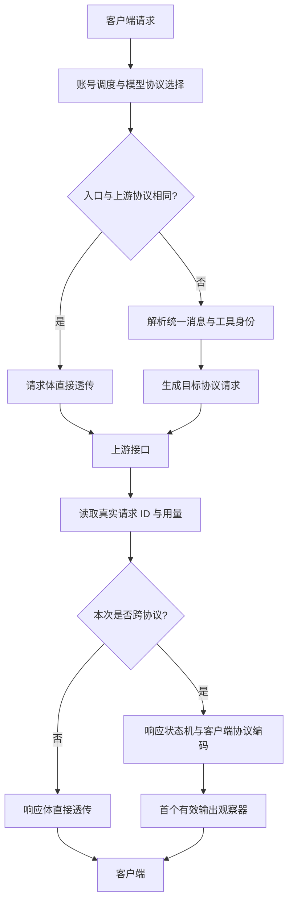

# 协议转换实现原理与实现方案

[返回中文首页](../README.md) · [English README](../README.en.md) · [技术参考](reference.zh-CN.md)

本文依据当前仓库代码说明已经实现的转换机制，覆盖 Chat Completions、Responses 与 Anthropic Messages 的请求、JSON 响应和 SSE 响应。文中的支持范围指本地适配器能够处理的结构；模型是否接受这些字段，仍取决于实际上游能力。

## 1. 总体架构

三种协议表达了相近的交互过程：提交消息与工具定义，生成文本或工具调用，再提交工具结果继续对话。差异主要在消息组织方式、字段位置、工具参数编码、流事件生命周期和用量口径。

请求侧先把输入解析为统一的消息与内容块，再生成目标协议请求；响应侧将上游 JSON 或事件解析为输出块，由同一个状态机生成客户端需要的 JSON 或 SSE。这让每种协议分别承担解析和生成职责，不需要为六个跨协议方向各写一套完整实现。



同协议透传指请求和响应正文不经过语义重建；鉴权替换、账号调度、响应头筛选和统计观察仍由网关处理。

| 模块                                                  | 入口或核心对象                      | 职责                                      |
| ----------------------------------------------------- | ----------------------------------- | ----------------------------------------- |
| [模型协议选择](../src/shared/model-protocols.ts)      | `modelUpstreamRoute`                | 按账号、模型配置选择上游接口              |
| [供应商默认路由](../src/shared/opencode-go.ts)        | `openCodeGoRoute`                   | OpenCode Go 默认协议、会话标识与额度解析  |
| [请求转换](../src/main/services/protocol-request.ts)  | `convertRequest`                    | 消息、工具、参数和结构化输出映射          |
| [响应转换](../src/main/services/protocol-response.ts) | `convertResponse`、`ResponseBridge` | JSON/SSE 解析、输出块管理与目标协议生成   |
| [网关集成](../src/main/services/gateway.ts)           | 请求处理中的 `pipeline`             | 转换调用、HTTP 状态、背压、取消和失败处理 |
| [用量解析](../src/shared/usage.ts)                    | `parseUsage`                        | 将缓存与输入输出用量转换为内部统一口径    |
| [上游观察](../src/main/services/response-ids.ts)      | `ResponseIdsObserver`               | 在转换前提取请求 ID、用量与流结束信息     |
| [首字观察](../src/main/services/first-token.ts)       | `FirstTokenObserver`                | 识别客户端侧首个有效输出                  |

## 2. 何时进入转换

客户端入口对应三个协议标识：

| 路径                   | 内部协议标识       |
| ---------------------- | ------------------ |
| `/v1/chat/completions` | `chat-completions` |
| `/v1/responses`        | `responses`        |
| `/v1/messages`         | `messages`         |

网关先获取账号租约，再执行 `modelUpstreamRoute(account, model, incoming)`。路由选择依次为：

1. 若该账号为该模型启用了客户端入口协议，优先原协议转发。
2. 否则选取该供应商默认协议中已启用的一种。
3. 若默认协议不可用，按 Messages、Responses、Chat Completions 的固定顺序选择已启用协议。
4. 没有启用协议时抛出错误。

Kimi 与 DeepSeek 默认启用三种协议；这是本地路由默认配置，不代表每个上游模型均支持全部接口。OpenCode Go 默认按模型名选择：`gpt-*`、`grok-*`、`muse-spark-*` 使用 Responses，`minimax-*`、`qwen*` 使用 Messages，其余使用 Chat Completions。账号上的模型协议配置可覆盖这些默认值。

只有 `targetRoute !== route` 时，网关才调用 `convertRequest`。发生账号重试时，会根据新账号重新计算路由，并重新从原始请求构造转换结果。

## 3. 请求转换的统一表示

### 3.1 消息与内容块

`messagesFrom` 将来源协议归一化为内部 `Message[]`，主要字段如下：

```typescript
interface Message {
  role: string
  content: Part[]
  calls?: Wire[]
  callId?: string
  reasoning?: string
  error?: boolean
}
```

`Part` 包含文本、图片和文件三类。工具调用保存在 `calls`，工具结果通过 `role: 'tool'` 和 `callId` 关联，工具错误通过 `error` 标记。这样，工具关系不依赖来源协议的消息外壳。

| 语义     | Chat Completions                  | Responses                         | Messages                             |
| -------- | --------------------------------- | --------------------------------- | ------------------------------------ |
| 前置指令 | `system` / `developer` 消息       | `instructions` 与输入消息         | 顶层 `system`                        |
| 普通消息 | `messages[]`                      | `input` 字符串或数组              | `messages[]`                         |
| 工具调用 | assistant 的 `tool_calls`         | `function_call` 输入项            | assistant 的 `tool_use` 内容块       |
| 工具结果 | `role: tool`、`tool_call_id`      | `function_call_output`、`call_id` | user 的 `tool_result`、`tool_use_id` |
| 明文思考 | `reasoning_content` / `reasoning` | reasoning 的 summary 或 content   | `thinking` 内容块                    |

Responses 的字符串 `input` 会成为一条 user 消息。其 `instructions` 会成为前置 system 消息。Responses 的工具调用和工具结果是独立输入项，解析后仍通过调用 ID 保持关联。

### 3.2 文本、图片与文件

文本块统一接收 `text`、`input_text`、`output_text`；请求历史中的 `refusal` 作为文本处理。图片统一存储为 URL，base64 图片会先构造 `data:MIME;base64,...`，生成 Messages 时再拆回 `source` 对象。

文件内容或 URL 可在 Responses 与 Messages 之间映射。Messages 的文本 document 直接变为文本；二进制 document 使用 data URL 或远程 URL。目标为 Chat Completions 时，文件块会报 400，要求调用者先提取文件文本。上游私有 `file_id` 也会报 400，因为不同接口之间没有共享文件存储的保证。

未识别的内容块类型会明确报错。图片、文件的结构能够映射，不意味着目标模型支持对应模态。

### 3.3 目标协议的消息组织

`messagesTo` 根据目标协议重新组织消息：

- **Chat Completions**：developer 转 system；合并开头连续的 system 指令；对话中途的 system/developer 保留位置，但降为 user 消息。工具结果正文仅保留文本，图片等媒体移到工具结果序列之后的 user 消息，并附调用 ID 提示。
- **Responses**：普通消息、函数调用和调用结果分别生成 input 项，并设置 `store: false`。工具结果文本放入 `function_call_output`，媒体放入额外 user 消息。assistant 的明文思考历史用 `<thinking>...</thinking>` 文本保留。
- **Messages**：system/developer 的文本汇总到顶层 `system`；工具调用放入 assistant 内容块，工具结果放入 user 内容块；相邻同角色消息合并。

这些规则包含语义折衷。例如，中途 developer 消息转 Chat 后不再具有原角色优先级；转 Messages 时 system/developer 会被集中到顶层。请求历史中的其他供应商思考内容不会被伪造成带有效签名的 Messages thinking 块。

## 4. 工具调用与多轮历史

### 4.1 历史配对与重排

目标为 Chat Completions 或 Messages 时，`normalizeToolHistory` 会整理历史：

1. 合并相邻 assistant 消息及其工具调用。
2. 建立调用 ID 到工具结果的映射；重复结果 ID 以映射中后出现的结果为准。
3. 只保留有结果且尚未使用的调用。
4. 把结果紧接在对应 assistant 调用之后，按调用顺序排列。
5. 丢弃孤立工具结果和没有结果的悬空调用；若 assistant 同时包含正文，仍保留正文。

例如，输入历史中的工具结果 B、普通通知、工具结果 A，可被整理为：

```text
assistant: 调用 A、调用 B
user/tool: 结果 A、结果 B
user: 普通通知
```

这样可以满足目标接口对调用与结果相邻、完整配对的要求。实现不会为中断的调用编造成功结果。工具结果中的图片转 Chat 时还会向后移动，避免在连续工具回复之间插入普通消息。目标为 Responses 时没有调用这套历史归一化逻辑。

### 4.2 工具定义与身份上下文

`toolsFrom` 将三种协议的客户端函数工具转换为统一定义，再输出为目标协议的 `tools`。参数 schema 的字段分别对应 `function.parameters`、`parameters` 和 `input_schema`。

`convertRequest` 同时返回 `BridgeContext`：

```typescript
interface BridgeContext {
  model: string
  tools: Map<
    string,
    {
      name: string
      namespace?: string
      custom: boolean
    }
  >
}
```

该上下文属于单次转换，随响应传给 `ResponseBridge`，用于将上游工具名称恢复为客户端原本声明的名称、命名空间与 custom 类型。

Responses 的 namespace 工具会被展开为 `namespace__name`。超过 64 个 UTF-8 字节时，按完整 Unicode 字符截断前缀，末尾追加 `__` 和完整名称 SHA-256 的前 8 个十六进制字符，总长度不超过 64 字节。声明、历史调用与指定工具选择使用同一算法；映射后名称冲突会直接报错。

Responses 的 custom 工具通过函数工具承载，其参数 schema 固定为包含字符串 `input` 的对象，禁止额外字段。上游返回后解析对象，并恢复为 `custom_tool_call.input`。缺少字符串 `input` 会报 502，不会当成空输入执行。此机制只保留自由文本输入，不提供 custom 工具原有格式约束的完整等价实现。

### 4.3 工具选择与参数校验

`tool_choice` 支持 auto、none、required/any，以及指定已声明工具；指定未声明名称会报 400。Messages 的 `disable_parallel_tool_use` 与其他协议的 `parallel_tool_calls` 互为布尔反值。

目标为 Messages 时，工具参数必须解析为 JSON 对象。响应侧在结束原因确定后验证工具参数；数组、损坏 JSON 或不符合 custom 包装的内容会失败。若结束原因为 token 上限，未写完的 JSON 按截断处理：Responses 保留部分 arguments 并标记 incomplete；Messages 省略无法表示为对象的工具块并返回 max_tokens。custom 工具包装未完成时不生成可执行的 input.done。此类截断不会触发账号冷却。网关只转发工具调用与结果，不负责执行客户端工具。

## 5. 生成参数与结构化输出

转换器显式构造目标请求，没有复制所有来源字段。未列入映射的扩展字段可能被省略，因此跨协议转换不能视为任意请求字段的无损迁移。

| 参数语义     | 当前映射规则                                                                                        |
| ------------ | --------------------------------------------------------------------------------------------------- |
| 模型         | 保留 `model`，要求非空字符串                                                                        |
| 流式         | 仅 `stream === true` 开启                                                                           |
| 采样         | 复制 `temperature`、`top_p`；目标非 Messages 且模型名以 `gpt-5` 开头时移除这两项                    |
| 输出上限     | 依次读取 `max_output_tokens`、`max_completion_tokens`、`max_tokens`，要求正安全整数                 |
| 目标上限字段 | Responses 用 `max_output_tokens`；Chat 用 `max_tokens`；Messages 用 `max_tokens`，未指定时默认 8192 |
| 停止序列     | Chat 与 Messages 之间映射 `stop` / `stop_sequences`，字符串转数组；目标 Responses 时不转发          |
| 思考强度     | 读取 `reasoning.effort`、`reasoning_effort` 或 `output_config.effort`；`max` 与 `xhigh` 按目标转换  |
| 并行工具     | 映射并行开关及 Messages 的反向开关                                                                  |
| 缓存键       | 目标 Responses 时保留 `prompt_cache_key`                                                            |
| 流式用量     | 目标 Chat 时设置 `stream_options.include_usage: true`                                               |

目标为 Messages，且强度不是 none、minimal、low，输出上限又大于 1024 时，会启用 thinking。预算取 `max_tokens - 1` 与强度预算的较小值：medium 为 4096、high 为 10240，其余为 32768。来源 Messages 仅声明 `thinking.type: enabled` 而未给强度时，其他目标使用 high；原始预算并非一比一迁移。

结构化输出在 Responses 的 `text.format`、Chat 的 `response_format` 与 Messages 的 `output_config.format` 之间映射。JSON Schema 先展平再包装到目标字段；Responses 和 Chat 缺少名称时补 `output`。普通 `type: text` 不触发格式转换。Messages 目标只接收 JSON Schema，其他非文本格式会报 400；strict 等字段也并非在所有目标中完整保留。

## 6. 响应状态机

### 6.1 统一输出块

`ResponseBridge` 维护 text、thinking、tool、refusal 四类 `Block`。每个块包含来源定位键、生成的输出项 ID、调用 ID、工具名、累计内容、签名和关闭状态。

状态机通过以下操作构建结果：

- `start`：只执行一次，生成目标协议起始事件。
- `block`：按键复用已有块，或创建并声明新块。
- `append`：累计增量，同时生成可立即发送的目标事件。
- `reconcile`：处理最终快照；若快照以已累计内容为前缀，只补缺少的后缀，避免重复输出；冲突内容报错。
- `close`：验证工具参数并关闭块，生成 done/stop 事件。
- `finish`：关闭全部块并生成终态。
- `json`：在完成且未失败时生成完整 JSON 响应。

响应 ID 和输出项 ID 由本地生成，工具调用 ID 在可用时沿用上游值。上游明确报告的 `request_id` 单独保留；响应对象的 `id` 不被当作真实请求 ID。

### 6.2 JSON 与 SSE 的组合

`convertResponse` 分别接收 `inputStream` 与 `outputStream`，因此可处理四种组合：

| 上游输入 | 客户端输出 | 执行方式                                    |
| -------- | ---------- | ------------------------------------------- |
| JSON     | JSON       | 缓冲 JSON，解析输出块，生成目标 JSON        |
| JSON     | SSE        | 完整 JSON 到达后，经状态机生成一组 SSE 事件 |
| SSE      | JSON       | 逐事件累计状态，确认终态后生成完整 JSON     |
| SSE      | SSE        | 逐事件转换，并在事件边界输出待发送内容      |

JSON 转 SSE 仅改变返回格式，不会使上游生成过程变成实时流式。SSE 转 SSE 也会保存有界的累计块内容，用于最终 JSON、快照校验和工具参数验证，并非恒定内存转换。

### 6.3 SSE 解码

解码器使用 `StringDecoder('utf8')` 处理被网络 chunk 分开的 UTF-8 字符。解析以换行组织事件，兼容 CRLF；多行 `data:` 用换行拼接，空行触发一次事件派发。`event:` 提供事件名，JSON 自带的 `type` 优先；注释、心跳和其他无关字段不生成正文输出。

Chat 的 `[DONE]` 触发结束；Messages 依赖 `message_stop`；Responses 接受完成、不完整等已实现的终态事件。网络 EOF 本身不等于生成成功：流结束时状态机仍未完成，会抛出 502。Responses 的 JSON 或终态快照若显式携带非终态 status，也会被拒绝。

| 目标协议  | 起始                                       | 正文/工具增量                                   | 结束                                                     |
| --------- | ------------------------------------------ | ----------------------------------------------- | -------------------------------------------------------- |
| Chat      | assistant role chunk                       | content、reasoning_content、tool_calls 等 delta | finish_reason、可选 usage chunk、`[DONE]`                |
| Messages  | `message_start`                            | `content_block_start/delta/stop`                | `message_delta`、`message_stop`                          |
| Responses | `response.created`、`response.in_progress` | output item、content part 和各类 delta          | 各类 done、`response.completed` 或 `response.incomplete` |

Responses 输出事件带递增 `sequence_number`。Responses 的 done 快照可补回未收到的文本增量，前提是与已输出前缀一致。

### 6.4 并行工具与延迟缓冲

Chat 可能先发送工具 ID 和参数片段，之后才发送工具名。适配器按工具 index 暂存参数，名称到达后创建正式块并补发积累内容；终态到达时仍缺名称会报错。

目标为 Messages 时，工具块等参数完整并通过 JSON 校验后才发送 start、参数 delta 和 stop。这样可以把上游交错到达的并行调用整理成完整块。普通文本和思考内容仍可增量输出。

目标为 Responses custom 工具时，必须等函数包装对象完整后才能提取 `input` 字符串，因此其输入 delta 也在关闭工具块时发送。两种缓冲都会影响工具输入的可见时机。

## 7. 结束原因、思考内容与用量

### 7.1 结束原因

内部常见结束原因包括 stop、length、tool_calls、stop_sequence 和 content_filter。Messages 的 max_tokens 转为 length；Responses 的 incomplete 根据原因转为 length 或 content_filter。输出 Responses 时二者分别成为 incomplete 的 max_output_tokens 或 content_filter 原因。

目标 Chat 将 stop_sequence 转为 stop；普通 stop 且存在工具块时改为 tool_calls。目标 Messages 优先把 length 映射为 max_tokens，再根据是否含工具块返回 tool_use，否则使用 stop_sequence 或 end_turn。当前 Messages 输出没有独立的 content_filter 映射，且 `stop_sequence` 字段返回 null，不保留具体命中的停止字符串。

仅包含 usage 的 Messages delta 不会清除此前的停止原因，防止达到输出上限的响应被误记为正常结束。

Chat 的 `aborted` 和 `insufficient_system_resource` 视为上游故障，跨协议返回失败状态；同协议正文保持透传，但请求历史和调度器记录失败，不计入成功率。

### 7.2 思考与拒绝信息

响应中的明文思考可映射到 Chat 的 reasoning_content、Responses 的 reasoning summary 或 Messages 的 thinking。实际存在的 Messages signature 可随块保存；适配器不会生成其他厂商认可的签名，也不保证转换后的思考历史能被目标模型重新接受。

加密 reasoning 不能解密迁移，redacted_thinking 会跳过。拒绝信息在 Chat、Responses 中有对应表示，目标 Messages 时降为普通文本。这些都意味着跨协议输出不能保证字节级或语义级的完全可逆。

### 7.3 缓存用量统一

内部 `TokenUsage` 将新增输入、输出、缓存读取、缓存创建和费用分开。OpenAI 风格输入总量包含缓存，解析时扣除已报告的缓存读取/创建；Messages 输入保持独立。生成 Chat/Responses 用量时再把缓存加回输入总量，生成 Messages 时分别返回各字段。

例如，上游报告输入 1000、缓存命中 600、输出 100，则内部为新增输入 400、缓存读取 600、输出 100；转换为 Messages 后分别返回这些数值，而不是重复计算 600 个缓存 token。

流中的用量按字段合并覆盖，不把累计快照反复相加。目标 Messages 起始事件会为必需字段补零，这只是输出格式占位。网关的统计观察器位于转换之前，读取真实上游用量；未报告的值在内部仍保持未知。

## 8. 网关管线、背压与错误处理

跨协议流式成功响应使用以下管线：

```text
上游 Readable
  → ResponseIdsObserver（上游协议：请求 ID、用量、结束状态）
  → convertResponse（上游协议 → 客户端协议）
  → FirstTokenObserver（客户端可见输出）
  → HTTP ServerResponse
```

`convertResponse` 是异步生成器，配合 Node.js `pipeline` 传播背压。下游读取慢时会限制上游消费速度。管线共享 AbortSignal；客户端断开、请求超时和网关关闭会取消进行中的转发，账号租约在 finally 中释放。

流式响应会先发送并刷新 HTTP 头，因此之后的转换错误不能再改写为 HTTP 502。显式的上游错误事件会转换为目标协议错误；解析异常、参数无效或流截断等异常则可能导致连接销毁。网关记录失败，不追加伪造的成功结束事件，也不会在已发送响应头后切换账号重试。

非流式转换先缓冲并确认成功，再提交上游 HTTP 状态和转换结果。这样，损坏的 JSON、空响应或无效终态可以在响应头发送前返回 502。上游非成功 HTTP 响应按错误正文路径处理，转换为客户端错误结构；非 JSON 错误正文使用通用错误消息。

请求结构不支持时，`ProtocolError` 默认使用 400；无效上游转换结果使用 502。可重试的上游状态由网关在提交响应前处理；协议转换异常不能简单理解为都会自动重试。

## 9. 资源限制与明确边界

| 项目               | 当前行为                                                                                  |
| ------------------ | ----------------------------------------------------------------------------------------- |
| SSE 事件大小       | 阈值为 `1024 * 1024`；当前事件解析按 JavaScript 字符串长度累计，不是严格的 UTF-8 字节限制 |
| 响应缓冲与累计内容 | 16 MiB；JSON 输入缓冲、状态机保留内容、网关输出缓冲分别有检查                             |
| 输出块数量         | 最多 1024 个；工具等待表等辅助映射也有数量保护                                            |
| 多候选输出         | 跨协议仅接受未指定 n 或 n=1；Chat 流遇到非零 choice index 报错                            |
| 上游私有历史       | previous_response_id、conversation、item_reference 明确拒绝，要求完整历史                 |
| 旧工具接口         | functions/function_call 明确拒绝，使用 tools/tool_calls                                   |
| 上游托管工具       | 搜索等托管工具定义不在转换范围，使用客户端函数工具                                        |
| 后台任务           | 跨协议 background 请求明确拒绝                                                            |
| 未映射字段         | 不保证保留，不构成完整协议兼容层                                                          |

OpenCode Go 的 `/v1/messages/count_tokens` 是独立的本地估算分支，不走上述生成转换。它序列化 system、messages 和 tools，将 ASCII 字符数除以 4 向上取整，再加非 ASCII 字符数，最少返回 1，并设置 `x-token-count-estimated: true`。这个值不是模型 tokenizer 的准确结果，也不能用于确认账单。

## 10. 一次工具调用的转换示例

假设客户端使用 Responses，而当前账号的模型只启用了 Messages：

1. 客户端在 tools 声明函数工具 `lookup`，在 input 提交用户问题。
2. 路由选择 Messages；请求解析生成统一 user 消息，工具 schema 转为 input_schema，同时建立工具身份映射。
3. 上游返回 tool_use，调用 ID 为 `call_1`，参数为一个 JSON 对象。
4. 响应状态机创建工具块，验证参数，再输出 Responses 的 function_call，保留 `call_1`。
5. 客户端执行工具，并在下一次请求中提交完整历史：用户问题、function_call、function_call_output。
6. 请求转换器将调用与结果配对，生成相邻的 assistant tool_use 和 user tool_result。
7. 上游生成最终文本，状态机输出 Responses 文本事件和完成事件。

工具由客户端执行，每次请求携带足够历史。网关的 BridgeContext 用于本次工具身份恢复，不保存可供下一次通过 previous_response_id 查询的服务端对话。

## 11. 现有验证覆盖

| 测试文件                                         | 覆盖内容                                                                                                   |
| ------------------------------------------------ | ---------------------------------------------------------------------------------------------------------- |
| [协议转换测试](../tests/protocol-bridge.test.ts) | 请求方向组合、JSON/SSE 组合、UTF-8 分块、并行工具、custom 与 namespace、用量、终态及真实本地 HTTP 网关集成 |
| [协议边界回归](../tests/protocol-audit.test.ts)  | 默认文本格式、schema 名称、工具历史、指令位置、延迟工具名、usage-only delta、无效 custom 参数和非终态响应  |
| [模型协议测试](../tests/model-protocols.test.ts) | 默认协议、同协议优先、手动配置持久化与重置                                                                 |
| [请求观察测试](../tests/response-ids.test.ts)    | 请求 ID、流事件与上游用量观察                                                                              |
| [首字计时测试](../tests/first-token.test.ts)     | 首个有效输出及初始化、心跳等事件的区分                                                                     |

这些测试主要使用构造响应和本地模拟上游，证明实现对指定输入的行为。它们不能替代实际供应商、具体模型和客户端版本的联调验证。
